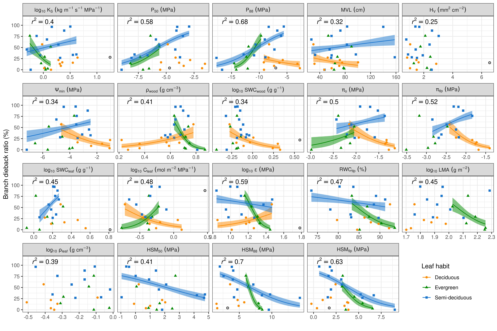
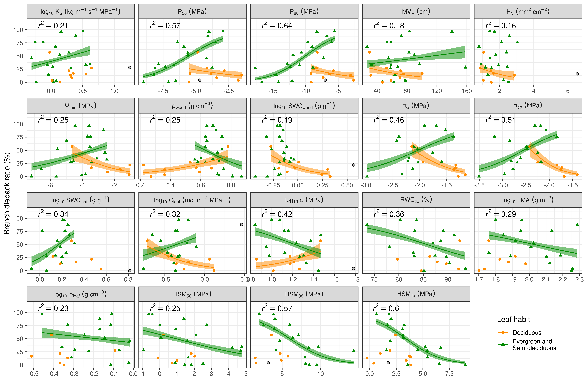
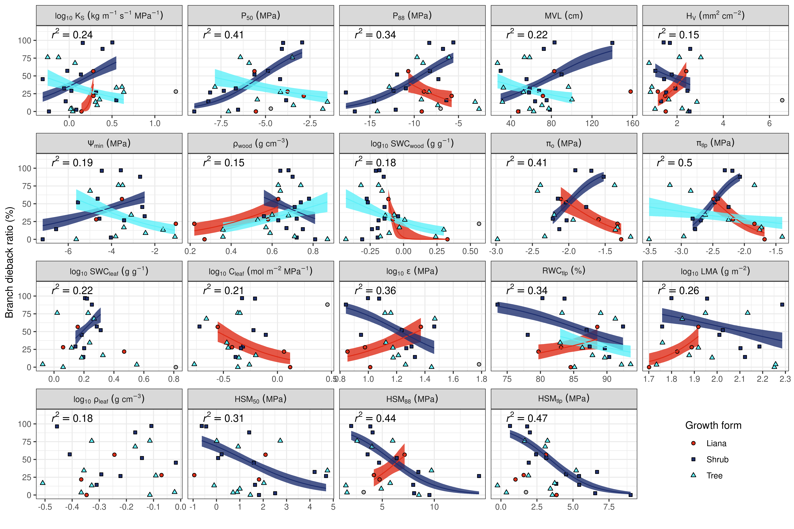
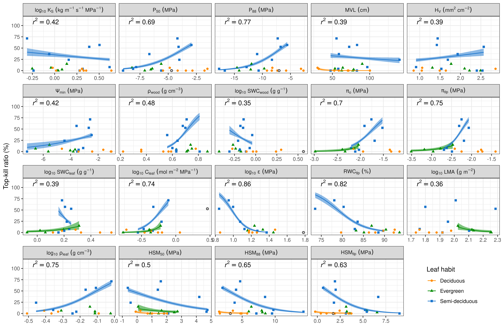
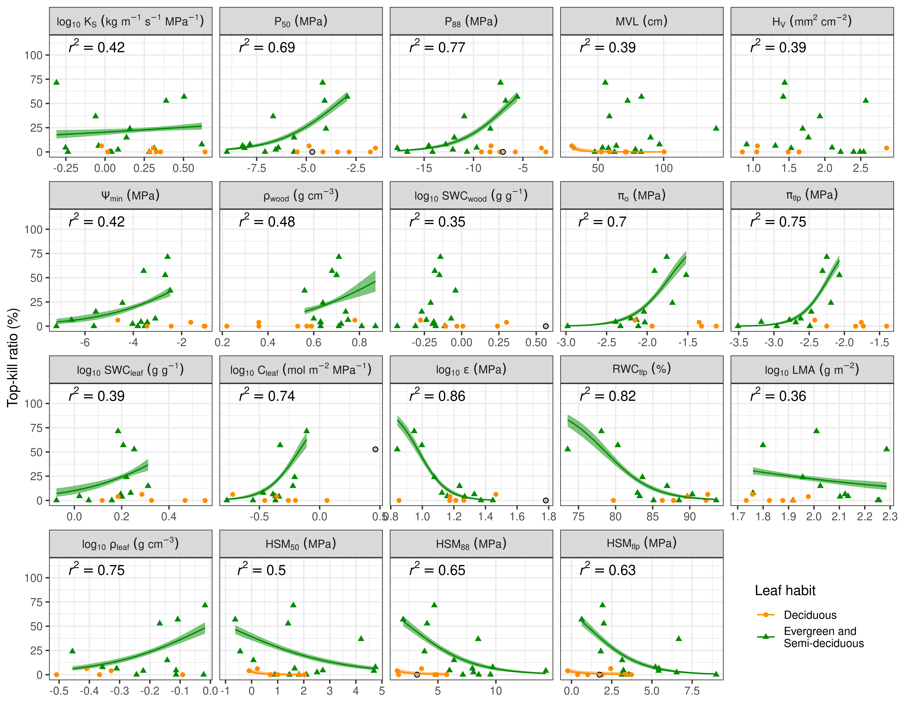
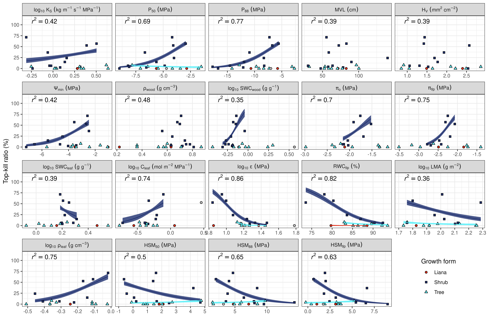

```{r global_options, include=FALSE}
knitr::opts_chunk$set(echo=TRUE, warning=FALSE, message=FALSE, cache=TRUE)
```

This R markdown file contains the code to reproduce the figures in "Hydraulic prediction of drought-induced plant dieback and top-kill depends on leaf habit and growth form" by Chen Ya-Jun et al. in Ecology Letters.

# Packages

```{r}
library(tidyverse)
library(rstanarm)
library(bayesplot)
library(tictoc)
library(ggpubr)
library(ggrepel)
library(kableExtra)
#rstan::rstan_options(auto_write = TRUE)
options(mc.cores = parallel::detectCores()) # Run on multiple cores

my_ggsave <- function(plot, filename, height = 11.4, width = 11.4, units = "cm", ...){
    ggsave(filename = filename,
           plot = plot,
           height = height,
           width = width,
           units = units,
           dpi = 600,
           ...)
}

theme_set(theme_bw())
```

# Data

This is how the data looks like.

```{r}
d <- read_csv("data/traits.csv") %>%
  mutate(Leafhabit2 = ifelse(Leafhabit == "D", "D", "E_SD"))

d <- d %>%
  rename(log10KS = KS) %>%
  rename(log10LMA =  LMA) %>%
  rename(log10rleaf =  rleaf) %>%
  rename(log10SWCleaf =  SWCleaf) %>%
  rename(log10epsilon =  epsilon) %>%
  rename(log10Cft =  Cft) %>%
  rename(log10WOODSWC =  WOODSWC) %>%
  mutate(log10KS =  log10(log10KS)) %>%
  mutate(log10LMA =  log10(log10LMA)) %>%
  mutate(log10rleaf =  log10(log10rleaf)) %>%
  mutate(log10SWCleaf =  log10(log10SWCleaf)) %>%
  mutate(log10epsilon =  log10(log10epsilon)) %>%
  mutate(log10Cft =  log10(log10Cft)) %>%
  mutate(log10WOODSWC =  log10(log10WOODSWC))

d %>%
  head %>%
  kable() %>%
  #kable_styling("hover")
  kable_styling()

```

# Outliers

We check outliers first.

```{r, fig.height=12, fig.width=12}
dl <- d %>%
  pivot_longer(MVL:RWCtlp) %>%
  mutate(name2 = case_when(
  name == "log10KS" ~ "log[10]~K[S]~(kg~m^{-1}~s^{-1}~MPa^{-1})",
  name == "log10Cft" ~ "log[10]~C[leaf]~(mol~m^-2~MPa^-1)",
  name == "P50" ~ "P[50]~(MPa)",
  name == "P88" ~ "P[88]~(MPa)",
  name == "HSM50" ~ "HSM[50]~(MPa)",
  name == "HSM88" ~ "HSM[88]~(MPa)",
  name == "HSMTLP" ~ "HSM[tlp]~(MPa)",
  name == "po" ~ "pi[o]~(MPa)",
  name == "ptlp" ~ "pi[tlp]~(MPa)",
  name == "HV" ~ "H[V]~(mm^2~cm^-2)",
  name == "Fmin" ~ "Psi[min]~(MPa)",
  name == "log10epsilon" ~ "log[10]~epsilon~(MPa)",
  name == "log10LMA" ~ "log[10]~LMA~(g~m^-2)",
  name == "MVL" ~ "MVL~(cm)",
  name == "log10SWCleaf" ~ "log[10]~SWC[leaf]~(g~g^-1)",
  name == "log10WOODSWC" ~ "log[10]~SWC[wood]~(g~g^-1)",
  name == "RWCtlp" ~ "RWC[tlp]~('%')",
  name == "log10rleaf" ~ "log[10]~rho[leaf]~(g~cm^-3)",
  name == "rxyl" ~ "rho[wood]~(g~cm^-3)",
  TRUE ~ name,
                          ))


dl %>%
  filter(!is.na(DeadTree)) %>%
  ggplot(., aes(x = value, y = DeadTree/AllTree * 100, col = Leafhabit)) +
  geom_point() +
  geom_text_repel(aes(label = Sp)) +
  facet_wrap(~name, scale = "free_x") +
  ylab("Top-kill ratio (%)")
```

```{r, fig.height=12, fig.width=12}
dl %>%
  filter(!is.na(DeadBranch)) %>%
  ggplot(., aes(x = value, y = DeadBranch/AllBranch * 100, col = Leafhabit)) +
  geom_point() +
  geom_text_repel(aes(label = Sp)) +
  facet_wrap(~name, scale = "free_x") +
  ylab("Branch dieback ratio (%)")
```


These seem to be outliers and we remove those sample from the
analysis.


| Trait    | Species     |
|----------|-------------|
| Cft      | WOF         |
| epslioin | PIW         |
| HV       | ACFA        |
| KS       | BACH        |
| SWCleaf  | ARO         |
| WOODSWC  | CIR         |
| P50      | PIW         |
| P88      | PIW         |
| HSM88    | PIW         |
| HSMTLP   | PIW         |


```{r}
dl <- dl %>%
  mutate(name2 = factor(name2,
         levels = c(
                    "log[10]~K[S]~(kg~m^{-1}~s^{-1}~MPa^{-1})",
                    "P[50]~(MPa)",
                    "P[88]~(MPa)",
                    "MVL~(cm)",
                    "H[V]~(mm^2~cm^-2)",
                    "Psi[min]~(MPa)",
                    "rho[wood]~(g~cm^-3)",
                    "log[10]~SWC[wood]~(g~g^-1)",
                    "pi[o]~(MPa)",
                    "pi[tlp]~(MPa)",
                    "log[10]~SWC[leaf]~(g~g^-1)",
                    "log[10]~C[leaf]~(mol~m^-2~MPa^-1)",
                    "log[10]~epsilon~(MPa)",
                    "RWC[tlp]~('%')",
                    "log[10]~LMA~(g~m^-2)",
                    "log[10]~rho[leaf]~(g~cm^-3)",
                    "HSM[50]~(MPa)",
                    "HSM[88]~(MPa)",
                    "HSM[tlp]~(MPa)"
         )))

dl0 <- dl

dl <- dl %>%
  filter(name != "log10Cft" | Sp != "WOF") %>%
  filter(name != "log10epsilon" | Sp != "PIW") %>%
  filter(name != "HV" | Sp != "ACFA") %>%
  filter(name != "log10KS" | Sp != "BACH") %>%
  filter(name != "log10SWCleaf" | Sp != "ARO") %>%
  filter(name != "log10WOODSWC" | Sp != "CIR") %>%
  filter(name != "P50" | Sp != "PIW") %>%
  filter(name != "P88" | Sp != "PIW") %>%
  filter(name != "HSM88" | Sp != "PIW") %>%
  filter(name != "HSMTLP" | Sp != "PIW")

dl_out <- dl0 %>%
  filter((name == "log10Cft" & Sp == "WOF") |
    (name == "log10epsilon" & Sp == "PIW") |
    (name == "HV" & Sp == "ACFA")  |
    (name == "log10KS" & Sp == "BACH") |
    (name == "log10SWCleaf" & Sp == "ARO")  |
    (name == "log10WOODSWC" & Sp == "CIR")  |
    (name == "P50" & Sp == "PIW")  |
    (name == "P88" & Sp == "PIW")  |
    (name == "HSM88" & Sp == "PIW")  |
    (name == "HSMTLP" & Sp == "PIW"))

```


# Model

## Each traits

- We model dieback and top-kill ratios as a function of each trait.
- We remove data that don't have mortatliy or branch death data.
- We also remove outliers (see above).

```{r stan-each, cache=TRUE, eval=TRUE, result='hide'}
set.seed(123)
n_iter <- 2000
n_chain <- 4
my_prior <- normal(location = 0, scale = 10, autoscale = TRUE)
my_prior_aux <- cauchy(location = 0, scale = 2.5, autoscale = FALSE)

tic()
nd <- dl %>%
  filter(!is.na(AllBranch)) %>%
  group_by(name) %>%
  nest() %>%
#  head(2) %>%
  mutate(m_branch_LH = map(data, ~  stan_glm(cbind(DeadBranch, AllBranch - DeadBranch) ~
                                      Leafhabit*value,
                                    iter = n_iter,
                                    chains = n_chain,
                                    prior = my_prior,
                                    refresh = 0,
                                    verbose = FALSE,
                                    prior_intercept = my_prior,
                                    data = ., family = binomial))) %>%
  mutate(m_branch_LH2 = map(data, ~  stan_glm(cbind(DeadBranch, AllBranch - DeadBranch) ~
                                      Leafhabit2*value,
                                    iter = n_iter,
                                    chains = n_chain,
                                    refresh = 0,
                                    verbose = FALSE,
                                    prior = my_prior,
                                    prior_intercept = my_prior,
                                    data = ., family = binomial))) %>%
  mutate(m_branch_LF = map(data, ~  stan_glm(cbind(DeadBranch, AllBranch - DeadBranch) ~
                                      Lifeform*value,
                                    iter = n_iter,
                                    chains = n_chain,
                                    refresh = 0,
                                    verbose = FALSE,
                                    prior = my_prior,
                                    prior_intercept = my_prior,
                                    data = ., family = binomial)))

nd_tree <- dl %>%
  filter(!is.na(AllTree)) %>%
  group_by(name) %>%
  nest() %>%
  mutate(m_tree_LH = map(data, ~  stan_glm(cbind(DeadTree, AllTree - DeadTree) ~
                                      Leafhabit*value,
                                    iter = n_iter,
                                    chains = n_chain,
                                    prior = my_prior,
                                    refresh = 0,
                                    verbose = FALSE,
                                    prior_intercept = my_prior,
                                    data = ., family = binomial))) %>%
  mutate(m_tree_LH2 = map(data, ~  stan_glm(cbind(DeadTree, AllTree - DeadTree) ~
                                      Leafhabit2*value,
                                    iter = n_iter,
                                    chains = n_chain,
                                    refresh = 0,
                                    verbose = FALSE,
                                    prior = my_prior,
                                    prior_intercept = my_prior,
                                    data = ., family = binomial))) %>%
  mutate(m_tree_LF = map(data, ~  stan_glm(cbind(DeadTree, AllTree - DeadTree) ~
                                      Lifeform*value,
                                    iter = n_iter,
                                    chains = n_chain,
                                    refresh = 0,
                                    verbose = FALSE,
                                    prior = my_prior,
                                    prior_intercept = my_prior,
                                    data = ., family = binomial)))
toc()
```

```{r}

check_fun <- function(posterior) {
  if (quantile(posterior, 0.975) > 0 & quantile(posterior, 0.025) > 0) {
    "sig"
  } else if (quantile(posterior, 0.975) < 0 & quantile(posterior, 0.025) < 0) {
    "sig"
} else "NS"}

check_dat_fun <- function(fit, gr) {
  pred_mat <- as_tibble(fit)

  if (gr == "Leafhabit") {
  tibble(Leafhabit = c("D", "E", "SD"),
         sig_LH = c(
                 check_fun(pred_mat$value),
                 check_fun(pred_mat$value + pred_mat$`LeafhabitE:value`),
                 check_fun(pred_mat$value + pred_mat$`LeafhabitSD:value`)
                 ))
  } else if (gr == "Leafhabit2") {
  tibble(Leafhabit2 = c("D", "E_SD"),
         sig_LH2 = c(
                 check_fun(pred_mat$value),
                 check_fun(pred_mat$value + pred_mat$`Leafhabit2E_SD:value`)
                 ))
  } else if (gr == "Lifeform"){
  tibble(Lifeform = c("L", "S", "T"),
         sig_LF = c(
                 check_fun(pred_mat$value),
                 check_fun(pred_mat$value + pred_mat$`LifeformS:value`),
                 check_fun(pred_mat$value + pred_mat$`LifeformT:value`)
                 ))
  }# else {
#
#  }
}

logistic <- function(x) 1 / (1 + exp (-x))

```


```{r}
dat_fun <- function(data, fit, gr = c("LH", "LH2", "LF")) {
  data2 <- data %>%
    dplyr::select(Leafhabit, Leafhabit2, Lifeform, value) %>%
    na.omit

  if (gr == "LH") {
    new_data <- data2 %>%
      group_by(Leafhabit) %>%
      summarize(min = min(value), max = max(value)) %>%
      group_by(Leafhabit) %>%
      nest %>%
      mutate(value = map(data, ~ seq(.[1,1] %>% unlist, .[1,2] %>% unlist, length.out = 80))) %>%
      dplyr::select(-data) %>%
      unnest(cols = c(value))
  } else if (gr == "LH2") {
    new_data <- data2 %>%
      group_by(Leafhabit2) %>%
      summarize(min = min(value), max = max(value)) %>%
      group_by(Leafhabit2) %>%
      nest %>%
      mutate(value = map(data, ~ seq(.[1,1] %>% unlist, .[1,2] %>% unlist, length.out = 80))) %>%
      dplyr::select(-data) %>%
      unnest(cols = c(value))
  } else if (gr == "LF") {
    new_data <- data2 %>%
      group_by(Lifeform) %>%
      summarize(min = min(value), max = max(value)) %>%
      group_by(Lifeform) %>%
      nest %>%
      mutate(value = map(data, ~ seq(.[1,1] %>% unlist, .[1,2] %>% unlist, length.out = 80))) %>%
      dplyr::select(-data) %>%
      unnest(cols = c(value))
  }

  pred_lin <- posterior_linpred(fit, newdata = new_data)

  tibble(
#    Leafhabit = new_data$Leafhabit,
#    Lifeform = new_data$Lifeform,
    median = pred_lin %>% apply(., 2, median),
    lower = pred_lin %>% apply(., 2, function(x)quantile(x, 0.025)),
    upper = pred_lin %>% apply(., 2, function(x)quantile(x, 0.975))) %>%
    bind_cols(new_data, .) %>%
    mutate(median_p = logistic(median)) %>%
    mutate(lower_p = logistic(lower)) %>%
    mutate(upper_p = logistic(upper))
}
```


```{r, eval=TRUE, cache=TRUE}
nd2 <- nd %>%
  mutate(dat_branch_LH = map2(data, m_branch_LH, dat_fun, "LH")) %>%
  mutate(dat_branch_LH2 = map2(data, m_branch_LH2, dat_fun, "LH2")) %>%
  mutate(dat_branch_LF = map2(data, m_branch_LF, dat_fun, "LF"))
```

```{r, eval=TRUE, cache=TRUE}
nd2_tree <- nd_tree %>%
  mutate(dat_tree_LH = map2(data, m_tree_LH, dat_fun, "LH")) %>%
  mutate(dat_tree_LH2 = map2(data, m_tree_LH2, dat_fun, "LH2")) %>%
  mutate(dat_tree_LF = map2(data, m_tree_LF, dat_fun, "LF"))
```

```{r,eval=TRUE}
save.image("data/model.Rda")
```


```{r, eval=FALSE}
load("data/model.Rda")
```


```{r,eval=TRUE}

nd_tmp <- dl %>%
  filter(!is.na(AllBranch)) %>%
  group_by(name, name2) %>%
  nest() %>%
  dplyr::select(name, name2) %>%
  mutate(name2 = factor(name2,
         levels = c(
                    "log[10]~K[S]~(kg~m^{-1}~s^{-1}~MPa^{-1})",
                    "P[50]~(MPa)",
                    "P[88]~(MPa)",
                    "MVL~(cm)",
                    "H[V]~(mm^2~cm^-2)",
                    "Psi[min]~(MPa)",
                    "rho[wood]~(g~cm^-3)",
                    "log[10]~SWC[wood]~(g~g^-1)",
                    "pi[o]~(MPa)",
                    "pi[tlp]~(MPa)",
                    "log[10]~SWC[leaf]~(g~g^-1)",
                    "log[10]~C[leaf]~(mol~m^-2~MPa^-1)",
                    "log[10]~epsilon~(MPa)",
                    "RWC[tlp]~('%')",
                    "log[10]~LMA~(g~m^-2)",
                    "log[10]~rho[leaf]~(g~cm^-3)",
                    "HSM[50]~(MPa)",
                    "HSM[88]~(MPa)",
                    "HSM[tlp]~(MPa)"
         )
  ))

nd <- left_join(nd, nd_tmp, by = "name")
nd2 <- left_join(nd2, nd_tmp, by = "name")
nd2_tree <- left_join(nd2_tree, nd_tmp, by = "name")

```


## Bayesian *R2*

Functions to get the Bayesian *R2* values.

```{r, eval=TRUE}
get_r2 <- function(ypred, y, median = TRUE) {
  e <- -1 * sweep(ypred, 2, y)
  var_ypred <- apply(ypred, 1, var)
  var_e <- apply(e, 1, var)
  r2 <- var_ypred / (var_ypred + var_e)
  if (median) median(r2) else r2
}

get_r2_fun <- function(fit, trait) {
  ypred <- posterior_linpred(fit) %>% logistic
  ypred <- ypred * 100
  get_r2(ypred, trait)
}
```

Next, we model the branch dieback and top-kill ratios as functions of groups (i.e.,
leaf habits or growth forms) to estimate the Bayesian *R2* for the group effects
alone models.


```{r, eval=TRUE}

dat_branch <- d %>% filter(!is.na(DeadBranch))

b_fit_LH <- stan_glm(cbind(DeadBranch, AllBranch - DeadBranch) ~
                     Leafhabit,
                   iter = n_iter,
                   chains = n_chain,
                   prior = my_prior,
                   refresh = 0,
                   verbose = FALSE,
                   prior_intercept = my_prior,
                   data = dat_branch, family = binomial)
b_fit_LH2 <- stan_glm(cbind(DeadBranch, AllBranch - DeadBranch) ~
                     Leafhabit2,
                   iter = n_iter,
                   chains = n_chain,
                   prior = my_prior,
                   refresh = 0,
                   verbose = FALSE,
                   prior_intercept = my_prior,
                   data = dat_branch, family = binomial)
b_fit_LF <- stan_glm(cbind(DeadBranch, AllBranch - DeadBranch) ~
                     Lifeform,
                   iter = n_iter,
                   chains = n_chain,
                   prior = my_prior,
                   refresh = 0,
                   verbose = FALSE,
                   prior_intercept = my_prior,
                   data = dat_branch, family = binomial)

dat_tree <- d %>% filter(!is.na(DeadTree))

t_fit_LH <- stan_glm(cbind(DeadTree, AllTree - DeadTree) ~
                     Leafhabit,
                   iter = n_iter,
                   chains = n_chain,
                   prior = my_prior,
                   refresh = 0,
                   verbose = FALSE,
                   prior_intercept = my_prior,
                   data = dat_tree, family = binomial)
t_fit_LH2 <- stan_glm(cbind(DeadTree, AllTree - DeadTree) ~
                     Leafhabit2,
                   iter = n_iter,
                   chains = n_chain,
                   prior = my_prior,
                   refresh = 0,
                   verbose = FALSE,
                   prior_intercept = my_prior,
                   data = dat_tree, family = binomial)
t_fit_LF <- stan_glm(cbind(DeadTree, AllTree - DeadTree) ~
                     Lifeform,
                   iter = n_iter,
                   chains = n_chain,
                   prior = my_prior,
                   refresh = 0,
                   verbose = FALSE,
                   prior_intercept = my_prior,
                   data = dat_tree, family = binomial)

```


*R^2^* for group effects alone models.

```{r, eval=TRUE}
r2_branch_LH_v <- get_r2_fun(b_fit_LH, dat_branch$Branchdiebak)
r2_branch_LH2_v <- get_r2_fun(b_fit_LH2, dat_branch$Branchdiebak)
r2_branch_LF_v <- get_r2_fun(b_fit_LF, dat_branch$Branchdiebak)
r2_tree_LH_v <- get_r2_fun(t_fit_LH, dat_tree$Mortality)
r2_tree_LH2_v <- get_r2_fun(t_fit_LH2, dat_tree$Mortality)
r2_tree_LF_v <- get_r2_fun(t_fit_LF, dat_tree$Mortality)

r2_dat <- tibble(
       model = c(
                 "dieback-Leafhabit (E, SD, L)",
                 "dieback-Leafhabit (E + SD, L)",
                 "dieback-Growthform",
                 "top-kill-Leafhabit (E, SD, L)",
                 "top-kill-Leafhabit (E + SD, L)",
                 "top-kill-Growthform"),
       r2 = c(
              r2_branch_LH_v,
              r2_branch_LH2_v,
              r2_branch_LF_v,
              r2_tree_LH_v,
              r2_tree_LH2_v,
              r2_tree_LF_v))

r2_dat %>%
  mutate(r2 = round(r2, 2)) %>%
  kable() %>%
  kable_styling()

```

For example, leaf habit alone explains 28% of variance in branch dieback (*r^2^* = 0.28).

```{r, eval=TRUE}
r2_branch <- nd2 %>%
  mutate(data2 = map(data, ~ filter(., !is.na(value))))%>%
  mutate(branch_diebak = map(data2, ~ .$Branchdiebak)) %>%
#  mutate(branch_diebak_raw = map(branch_diebak, ~ logit(. /100))) %>%
  mutate(pred_branch_LH = map(m_branch_LH, ~ logistic(posterior_linpred(.)) * 100)) %>%
  mutate(pred_branch_LH2 = map(m_branch_LH2, ~ logistic(posterior_linpred(.)) * 100)) %>%
  mutate(pred_branch_LF = map(m_branch_LF, ~ logistic(posterior_linpred(.)) * 100)) %>%
#  mutate(pred_branch_LH_raw = map(m_branch_LH, ~ posterior_linpred(.))) %>%
  mutate(r2_branch_LH = map2_dbl(pred_branch_LH, branch_diebak,  get_r2)) %>%
  mutate(r2_branch_LH2 = map2_dbl(pred_branch_LH2, branch_diebak,  get_r2)) %>%
  mutate(r2_branch_LF = map2_dbl(pred_branch_LF, branch_diebak,  get_r2)) %>%
#  mutate(r2_branch_LH_raw = map2_dbl(pred_branch_LH_raw, branch_diebak_raw,  get_r2)) %>%
  #dplyr::select(name, r2_branch_LH, r2_branch_LH_raw) %>%
  dplyr::select(name, r2_branch_LH, r2_branch_LH2, r2_branch_LF)# %>%
  #arrange(desc(r2_branch_LH))


tibble(trait = r2_branch$name, round(r2_branch[,2:4], 2)) %>%
  rename(`3 Leaf habit` = "r2_branch_LH") %>%
  rename(`2 Leaf habit` = "r2_branch_LH2") %>%
  rename(`Growth form` = "r2_branch_LF") %>%
  kable() %>%
  add_header_above(c(" ", "R2 values" = 3)) %>%
  kable_styling()

r2_tree <- nd2_tree %>%
  mutate(data2 = map(data, ~ filter(., !is.na(value))))%>%
  mutate(mort = map(data2, ~ .$Mortality)) %>%
  mutate(pred_tree_LH = map(m_tree_LH, ~ logistic(posterior_linpred(.)) * 100)) %>%
  mutate(pred_tree_LH2 = map(m_tree_LH2, ~ logistic(posterior_linpred(.)) * 100)) %>%
  mutate(pred_tree_LF = map(m_tree_LF, ~ logistic(posterior_linpred(.)) * 100)) %>%
  mutate(r2_tree_LH = map2_dbl(pred_tree_LH, mort,  get_r2)) %>%
  mutate(r2_tree_LH2 = map2_dbl(pred_tree_LH2, mort,  get_r2)) %>%
  mutate(r2_tree_LF = map2_dbl(pred_tree_LF, mort,  get_r2)) %>%
  dplyr::select(name, r2_tree_LH, r2_tree_LH2, r2_tree_LF)# %>%
  #arrange(desc(r2_tree_LH))

tibble(trait = r2_tree$name, round(r2_tree[,2:4], 2)) %>%
  rename(`3 Leaf habit` = "r2_tree_LH") %>%
  rename(`2 Leaf habit` = "r2_tree_LH2") %>%
  rename(`Growth form` = "r2_tree_LF") %>%
  kable() %>%
  add_header_above(c(" ", "R2 values" = 3)) %>%
  kable_styling()

```

# Figures

## Color code

- Evergreen: green "#008B00"
- Deciduous: orange "#FF8C00"
- Semi-deciduous: blue "#1874CD"
- Tree: light blue "#61f0f8"
- Liana: red "#de2e19"
- Shrub: dark blue "#1f306f"

```{r}
gr <- "#008B00"
or <- "#FF8C00"
bl <- "#1874CD"
br <- "#8B7355"
lbl <- "#61F0F8"
re <- "#DE2E19"
dbl <- "#1F306F"

my_col <- c(gr, or, bl, lbl, re, dbl)

expand.grid(x = 1:3, y = 1:2) %>%
  mutate(gr = c("Evergreen", "Deciduous", "Semi-diciduous", "Tree", "Liana",
                "Shurb")) %>%
  mutate(my_col = my_col) %>%
  ggplot(aes(x, y, fill = I(my_col))) +
  geom_tile() +
  annotate("text", x = 1:3, y = 1, label = c("Evergreen", "Deciduous", "Semi-deciduous")) +
  annotate("text", x = 1:3, y = 2, label = c("Tree", "Liana", "Shrub"), size = 4) +
  coord_equal() +
  theme_void() +
  scale_y_reverse()


LF_shapes <- c("Liana"=16, "Shrub"=17, "Tree"=15)
LF_shapes2 <- c("L"=21, "S"=22, "T"=24)
LH_shapes <- c("D"=16, "E"=17, "SD"=15)

```

## Branch dieback ratio and 3 leaf habits

```{r}

sig_LH <- nd2 %>%
  mutate(sig_LH = map(m_branch_LH,  check_dat_fun, "Leafhabit")) %>%
#  mutate(sig_LF= map(m_branch_LF, check_dat_fun, "Lifeform")) %>%
  dplyr::select(sig_LH) %>%
  unnest(c( sig_LH))

sig_LH2 <- nd2 %>%
  mutate(sig_LH2 = map(m_branch_LH2,  check_dat_fun, "Leafhabit2")) %>%
#  mutate(sig_LF= map(m_branch_LF, check_dat_fun, "Lifeform")) %>%
  dplyr::select(sig_LH2) %>%
  unnest(c( sig_LH2))

sig_LF <- nd2 %>%
  mutate(sig_LF = map(m_branch_LF,  check_dat_fun, "Lifeform")) %>%
#  mutate(sig_LF= map(m_branch_LF, check_dat_fun, "Lifeform")) %>%
  dplyr::select(sig_LF) %>%
  unnest(c( sig_LF))


r2_branch2 <- r2_branch %>%
  left_join(., nd2, by = "name") %>%
  dplyr::select(name, r2_branch_LH, r2_branch_LH2, r2_branch_LF, data) %>%
  mutate(min_x = map_dbl(data, ~ min(.$value, na.rm = TRUE))) %>%
  mutate(max_x = map_dbl(data, ~ max(.$value, na.rm = TRUE))) %>%
  #dplyr::select(name, r2_branch_LH, data) %>%
  unnest(cols = data) %>%
  dplyr::select(name, name2, min_x, max_x, r2_branch_LH, r2_branch_LH2, r2_branch_LF) %>%
  unique %>%
  mutate(Leafhabit = "D") %>%
  mutate(Leafhabit2 = "D") %>%
  mutate(Lifeform = "T") %>%
  mutate(r2_branch_LF = round(r2_branch_LF, 2) %>% format(., nsmall = 2)) %>%
  mutate(r2_branch_LH2 = round(r2_branch_LH2, 2) %>% format(., nsmall = 2)) %>%
  mutate(r2_branch_LH = round(r2_branch_LH, 2) %>% format(., nsmall = 2)) %>%
  mutate(LH_lab = paste0("italic(r^2) == ", r2_branch_LH)) %>%
  mutate(LH2_lab = paste0("italic(r^2) == ", r2_branch_LH2)) %>%
  mutate(LF_lab = paste0("italic(r^2) == ", r2_branch_LF))

p_B_LH_R2 <- nd2 %>%
  dplyr::select(name2, dat_branch_LH) %>%
  unnest(c(dat_branch_LH)) %>%
  ungroup %>%
  left_join(., sig_LH, by = c("Leafhabit", "name")) %>%
  filter(sig_LH == "sig") %>%
  ggplot(., aes(x = value, col = Leafhabit, shape = Leafhabit)) +
    geom_ribbon(aes(ymin = lower_p * 100, ymax = upper_p * 100, fill =
                    Leafhabit), alpha = 0.5, col = "transparent",
                show.legend = FALSE) +
    geom_point(data = dl %>% filter(!is.na(AllBranch)), aes(x = value, y = DeadBranch/AllBranch * 100)) +
    geom_point(data = dl_out %>% filter(!is.na(AllBranch)),
               aes(y = DeadBranch/AllBranch * 100), fill = "grey", col = "black", pch = 21) +
    geom_line(aes(y = median_p * 100)) +
    geom_text(data = r2_branch2,
              aes(y = 110, x = min_x, label = LH_lab),
              hjust = -0.2,
              parse = TRUE,
              col = "black"
              ) +
    facet_wrap(~name2, scale = "free_x", label = label_parsed) +
    scale_linetype_manual(values = c(2, 1)) +
    scale_shape_manual(values = LH_shapes,
                        labels = c("Deciduous", "Evergreen", "Semi-deciduous")) +
    scale_colour_manual(values = c(or, gr, bl),
                        labels = c("Deciduous", "Evergreen", "Semi-deciduous")) +
    scale_fill_manual(values = c(or, gr, bl)) +
    scale_y_continuous(breaks = seq(0, 100, length = 5),
                       limits = c(0, 115)) +
    ylab("Branch dieback ratio (%)") +
    xlab("") +
    labs(color = "Leaf habit", shape = "Leaf habit") +
    theme(legend.position = c(0.9, 0.1))

my_ggsave(p_B_LH_R2, "figs/BD_LH_R2.png", height = 20, width = 30)
my_ggsave(p_B_LH_R2, "figs/BD_LH_R2.pdf", height = 20, width = 30)

```



## Branch dieback ratio and 2 leaf habits

```{r}
p_B_LH2_R2 <- nd2 %>%
  dplyr::select(name2, dat_branch_LH2) %>%
  unnest(c(dat_branch_LH2)) %>%
  ungroup %>%
  left_join(., sig_LH2, by = c("Leafhabit2", "name")) %>%
  filter(sig_LH2 == "sig") %>%
  ggplot(., aes(x = value, col = Leafhabit2, shape = Leafhabit2)) +
    geom_ribbon(aes(ymin = lower_p * 100, ymax = upper_p * 100, fill =
                    Leafhabit2), alpha = 0.5, col = "transparent",
                show.legend = FALSE) +
    geom_point(data = dl %>% filter(!is.na(AllBranch)), aes(x = value, y = DeadBranch/AllBranch * 100)) +
    geom_point(data = dl_out %>% filter(!is.na(AllBranch)),
               aes(y = DeadBranch/AllBranch * 100), fill = "grey", col = "black", pch = 21) +
    geom_line(aes(y = median_p * 100)) +
    geom_text(data = r2_branch2,
              aes(y = 110, x = min_x, label = LH2_lab),
              hjust = -0.2,
              parse = TRUE,
              col = "black"
              ) +
    facet_wrap(~name2, scale = "free_x", label = label_parsed) +
    scale_linetype_manual(values = c(2, 1)) +
    scale_shape_manual(values = c(16, 17),
                        labels = c("Deciduous", "Evergreen and \nSemi-deciduous")) +
    scale_colour_manual(values = c(or, gr),
                        labels = c("Deciduous", "Evergreen and \nSemi-deciduous")) +
    scale_fill_manual(values = c(or, gr)) +
    scale_y_continuous(breaks = seq(0, 100, length = 5),
                       limits = c(0, 115)) +
    ylab("Branch dieback ratio (%)") +
    xlab("") +
    labs(color = "Leaf habit", shape = "Leaf habit") +
    theme(legend.position = c(0.9, 0.1))

my_ggsave(p_B_LH2_R2, "figs/BD_LH2_R2.png", height = 20, width = 30)
my_ggsave(p_B_LH2_R2, "figs/BD_LH2_R2.pdf", height = 20, width = 30)

```



## Branch dieback ratio and growth forms

```{r}
p_B_LF_R2 <- nd2 %>%
  dplyr::select(name2, dat_branch_LF) %>%
  unnest(c(dat_branch_LF)) %>%
  ungroup %>%
  left_join(., sig_LF, by = c("Lifeform", "name")) %>%
  filter(sig_LF == "sig") %>%
  ggplot(., aes(x = value, col = Lifeform, fill = Lifeform)) +
    geom_ribbon(aes(ymin = lower_p * 100, ymax = upper_p * 100, fill =
                    Lifeform), alpha = 0.8, col = "transparent",
                show.legend = FALSE) +
    geom_point(data = dl %>% filter(!is.na(AllBranch)), aes(x = value, y = DeadBranch/AllBranch * 100, shape = Lifeform), col = "black") +
    geom_point(data = dl_out %>% filter(!is.na(AllBranch)),
               aes(y = DeadBranch/AllBranch * 100), fill = "grey", col = "black", pch = 21) +
    geom_line(aes(y = median_p * 100)) +
    geom_text(data = r2_branch2,
              aes(y = 110, x = min_x, label = LF_lab),
              hjust = -0.2,
              parse = TRUE,
              col = "black"
              ) +
    facet_wrap(~name2, scale = "free_x", label = label_parsed) +
    #scale_linetype_manual(values = c(2, 1)) +
    scale_shape_manual(values = LF_shapes2,
                      labels = c("Liana", "Shrub", "Tree")) +
    scale_colour_manual(values = c(re, dbl, lbl
                                #)) +
                                ), guide = "none") +
    scale_fill_manual(values = c(re, dbl, lbl),
                      labels = c("Liana", "Shrub", "Tree")
                                ) +
    ylab("Branch dieback ratio (%)") +
    xlab("") +
    labs(fill = "Growth form", shape = "Growth form", col = "Growth form") +
    scale_y_continuous(breaks = seq(0, 100, length = 5),
                       limits = c(0, 115)) +
    theme(legend.position = c(0.9, 0.1))

my_ggsave(p_B_LF_R2, "figs/BD_LF_R2.png", height = 20, width = 30)
my_ggsave(p_B_LF_R2, "figs/BD_LF_R2.pdf", height = 20, width = 30)


```



## Top-kill ratio and 3 leaf habits

```{r}
sig_LH <- nd2_tree %>%
  mutate(sig_LH = map(m_tree_LH,  check_dat_fun, "Leafhabit")) %>%
#  mutate(sig_LF= map(m_tree_LF, check_dat_fun, "Lifeform")) %>%
  dplyr::select(sig_LH) %>%
  unnest(c( sig_LH))

sig_LH2 <- nd2_tree %>%
  mutate(sig_LH2 = map(m_tree_LH2,  check_dat_fun, "Leafhabit2")) %>%
#  mutate(sig_LF= map(m_tree_LF, check_dat_fun, "Lifeform")) %>%
  dplyr::select(sig_LH2) %>%
  unnest(c( sig_LH2))

sig_LF <- nd2_tree %>%
  mutate(sig_LF = map(m_tree_LF,  check_dat_fun, "Lifeform")) %>%
#  mutate(sig_LF= map(m_tree_LF, check_dat_fun, "Lifeform")) %>%
  dplyr::select(sig_LF) %>%
  unnest(c( sig_LF))

r2_tree2 <- r2_tree %>%
  left_join(., nd2, by = "name") %>%
  dplyr::select(name, r2_tree_LH, r2_tree_LH2, r2_tree_LF, data) %>%
  mutate(min_x = map_dbl(data, ~ min(.$value, na.rm = TRUE))) %>%
  mutate(max_x = map_dbl(data, ~ max(.$value, na.rm = TRUE))) %>%
  #dplyr::select(name, r2_tree_LH, data) %>%
  unnest(cols = data) %>%
  dplyr::select(name, name2, min_x, max_x, r2_tree_LH, r2_tree_LH2, r2_tree_LF) %>%
  unique %>%
  mutate(Leafhabit = "D") %>%
  mutate(Leafhabit2 = "D") %>%
  mutate(Lifeform = "T") %>%
  mutate(r2_tree_LF = round(r2_tree_LF, 2) %>% format(., nsmall = 2)) %>%
  mutate(r2_tree_LH2 = round(r2_tree_LH2, 2) %>% format(., nsmall = 2)) %>%
  mutate(r2_tree_LH = round(r2_tree_LH, 2) %>% format(., nsmall = 2)) %>%
  mutate(LH_lab = paste0("italic(r^2) == ", r2_tree_LH)) %>%
  mutate(LH2_lab = paste0("italic(r^2) == ", r2_tree_LH2)) %>%
  mutate(LF_lab = paste0("italic(r^2) == ", r2_tree_LF))

p_T_LH_R2 <- nd2_tree %>%
  dplyr::select(name2, dat_tree_LH) %>%
  unnest(c(dat_tree_LH)) %>%
  ungroup %>%
  left_join(., sig_LH, by = c("Leafhabit", "name")) %>%
  filter(sig_LH == "sig") %>%
  ggplot(., aes(x = value, col = Leafhabit, shape = Leafhabit)) +
    geom_ribbon(aes(ymin = lower_p * 100, ymax = upper_p * 100, fill =
                    Leafhabit), alpha = 0.5, col = "transparent",
                show.legend = FALSE) +
    geom_point(data = dl %>% filter(!is.na(AllTree)), aes(x = value, y = DeadTree/AllTree * 100)) +
    geom_point(data = dl_out %>% filter(!is.na(AllTree)),
               aes(y = DeadTree/AllTree * 100), fill = "grey", col = "black", pch = 21) +
    geom_line(aes(y = median_p * 100)) +
    geom_text(data = r2_tree2,
              aes(y = 110, x = min_x, label = LH_lab),
              hjust = -0.2,
              parse = TRUE,
              col = "black"
              ) +
    facet_wrap(~name2, scale = "free_x", label = label_parsed) +
    scale_linetype_manual(values = c(2, 1)) +
    scale_shape_manual(values = LH_shapes,
                        labels = c("Deciduous", "Evergreen", "Semi-deciduous")) +
    scale_colour_manual(values = c(or, gr, bl),
                        labels = c("Deciduous", "Evergreen", "Semi-deciduous")) +
    scale_fill_manual(values = c(or, gr, bl)) +
    scale_y_continuous(breaks = seq(0, 100, length = 5),
                       limits = c(0, 115)) +
    ylab("Top-kill ratio (%)") +
    xlab("") +
    labs(color = "Leaf habit", shape = "Leaf habit") +
    theme(legend.position = c(0.9, 0.1))

my_ggsave(p_T_LH_R2, "figs/TD_LH_R2.png", height = 20, width = 30)
my_ggsave(p_T_LH_R2, "figs/TD_LH_R2.pdf", height = 20, width = 30)

```



## Top-kill ratio and 2 leaf habits

```{r}
p_T_LH2_R2 <- nd2_tree %>%
  dplyr::select(name2, dat_tree_LH2) %>%
  unnest(c(dat_tree_LH2)) %>%
  ungroup %>%
  left_join(., sig_LH2, by = c("Leafhabit2", "name")) %>%
  filter(sig_LH2 == "sig") %>%
  ggplot(., aes(x = value, col = Leafhabit2, shape = Leafhabit2)) +
    geom_ribbon(aes(ymin = lower_p * 100, ymax = upper_p * 100, fill =
                    Leafhabit2), alpha = 0.5, col = "transparent", show.legend
  = FALSE) +
    geom_point(data = dl %>% filter(!is.na(AllTree)), aes(x = value, y = DeadTree/AllTree * 100)) +
    geom_point(data = dl_out %>% filter(!is.na(AllTree)),
               aes(y = DeadTree/AllTree * 100), fill = "grey", col = "black", pch = 21) +
    geom_line(aes(y = median_p * 100)) +
    geom_text(data = r2_tree2,
              aes(y = 110, x = min_x, label = LH_lab),
              hjust = -0.2,
              parse = TRUE,
              col = "black"
              ) +
    facet_wrap(~name2, scale = "free_x", label = label_parsed) +
    scale_linetype_manual(values = c(2, 1)) +
    scale_shape_manual(values = c(16, 17),
                        labels = c("Deciduous", "Evergreen and \nSemi-deciduous")) +
    scale_colour_manual(values = c(or, gr),
                        labels = c("Deciduous", "Evergreen and \nSemi-deciduous")) +
    scale_fill_manual(values = c(or, gr
                                )) +
    scale_y_continuous(breaks = seq(0, 100, length = 5),
                       limits = c(0, 115)) +
    ylab("Top-kill ratio (%)") +
    xlab("") +
    labs(color = "Leaf habit", shape = "Leaf habit") +
    theme(legend.position = c(0.9, 0.1))

my_ggsave(p_T_LH2_R2, "figs/TD_LH2_R2.png", height = 20, width = 25)
my_ggsave(p_T_LH2_R2, "figs/TD_LH2_R2.pdf", height = 20, width = 25)

```



## Top-kill ratio and growth forms

```{r}

p_T_LF_R2 <- nd2_tree %>%
  dplyr::select(name2, dat_tree_LF) %>%
  unnest(c(dat_tree_LF)) %>%
  ungroup %>%
  left_join(., sig_LF, by = c("Lifeform", "name")) %>%
  filter(sig_LF == "sig") %>%
  ggplot(., aes(x = value, col = Lifeform, fill = Lifeform)) +
    geom_ribbon(aes(ymin = lower_p * 100, ymax = upper_p * 100, fill =
                    Lifeform), alpha = 0.8, col = "transparent",
                show.legend = FALSE) +
    geom_point(data = dl %>% filter(!is.na(AllTree)),
               aes(x = value, y = DeadTree/AllTree * 100,
                   shape = Lifeform),
               col = "black"
               ) +
    geom_point(data = dl_out %>% filter(!is.na(AllTree)),
               aes(y = DeadTree/AllTree * 100), fill = "grey", col = "black", pch = 21) +
    geom_line(aes(y = median_p * 100)) +
    geom_text(data = r2_tree2,
              aes(y = 110, x = min_x, label = LH_lab),
              hjust = -0.2,
              parse = TRUE,
              col = "black"
              ) +
    facet_wrap(~name2, scale = "free_x", label = label_parsed) +
    scale_shape_manual(values = LF_shapes2,
                      labels = c("Liana", "Shrub", "Tree")) +
    scale_colour_manual(values = c(re, dbl, lbl
                                ), guide = "none") +
    scale_fill_manual(values = c(re, dbl, lbl),
                      labels = c("Liana", "Shrub", "Tree")
                                ) +
    labs(fill = "Growth form") +
    scale_y_continuous(breaks = seq(0, 100, length = 5),
                       limits = c(0, 115)) +
    labs(fill = "Growth form", shape = "Growth form", col = "Growth form") +
    ylab("Top-kill ratio (%)") +
    xlab("") +
    theme(legend.position = c(0.9, 0.1))

my_ggsave(p_T_LF_R2, "figs/TD_LF_R2.png", height = 20, width = 30)
my_ggsave(p_T_LF_R2, "figs/TD_LF_R2.pdf", height = 20, width = 30)

```



# Computing Environment

```{r}
devtools::session_info()
```

